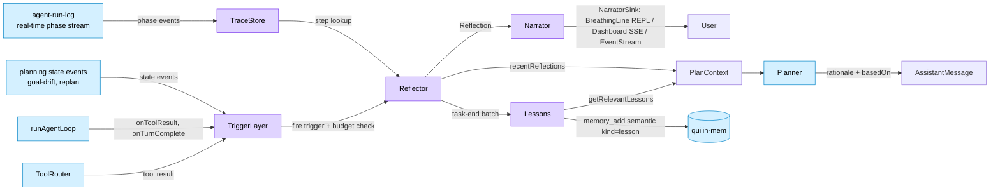

# 元思考 / Introspection — 设计文档 / Design Doc

> Linear: [Iter L+3：元思考 / Introspection](https://linear.app/quilin-agent/project/iter-l3yuan思考-introspection-2bb870059835) · 总入口 [QUI-151](https://linear.app/quilin-agent/issue/QUI-151)
>
> 状态 / Status：**Step 2 设计文档（实施前 review gate）** / **Step 2 design doc (pre-implementation review gate)**
>
> 涉及组件 / Components touched：00-Core Loop, 02-Context, 03-Memory, 04-Planning, 08-Observability, 10-Self-Evolution
>
> 写入约定 / Writing convention：中英双语段落对照（标题 `中文 / English`，正文英文段落 → 中文段落成对排列）。/ Bilingual paragraph-paired (titles `Chinese / English`, body English-then-Chinese pairs).

---

## 一、目标与硬约束 / Goal and Hard Constraints

### 目标 / Goal

Add a meta-cognition / introspection layer to Quilin so the agent can reflect on its own execution at key moments, anchor those reflections to real trace evidence, feed them back into subsequent planning, and surface the thinking to the user with a controlled rhythm.

为 Quilin 增加元思考 / 内观能力，让 Agent 能在关键时刻反思自己的执行、把反思**锚定到真实 trace 证据**、让反思真正反过来影响后续规划，并以受控节奏向用户展示思考过程。

The end user perception we are buying: **"the agent looks smarter because it explains why it changed approach, references specific steps, and we trust its decisions more"** — without the agent generating freestyle internal monologue that turns into hallucination noise.

我们要兑现的用户感知：**"Agent 看起来更聪明，因为它能解释为什么换了思路、能指向具体某一步、决策更可信"** —— 但**不**是让 Agent 自由发挥内心独白结果变成幻觉噪声。

### 硬约束 / Hard Constraints

The following constraints come straight from the user's prompt and were locked during Step 1 Q&A. Every design decision in this doc is checked against them; violations are flagged in §11.

下列约束直接来自用户 prompt，并在 Step 1 问答中锁定。本文档每个设计决策都对照检查；违反点列在 §11。

1. **Reflection must anchor to trace.** The Reflector prompt forces references to specific `step_id`s; the output schema enforces non-empty `referenced_step_ids`. This is the anti-hallucination core. / **反思必须锚定 trace。** Reflector prompt 强制引用具体 `step_id`；输出 schema 强制 `referenced_step_ids` 非空。这是反幻觉核心。
2. **Harness owns state.** No "let the LLM report progress" or "let the LLM manage context". All state is tracked explicitly in code. / **Harness 持有状态。** 不允许"让 LLM 汇报进度"或"让 LLM 管理 context"。所有状态由代码显式追踪。
3. **Structured output everywhere.** Reflector and Planner rationale are structured. Downstream consumers read fields, never regex over free text. / **全程结构化输出。** Reflector 和 Planner rationale 都结构化。下游靠字段消费，不靠正则解析自然语言。
4. **Rhythm control.** Narrator surfaces only at branch points and run end. Everything else is internalized. / **节奏控制。** Narrator 只在分叉点与任务结束时浮出，其他场合内部消化。
5. **Toggleable.** Every introspection capability is config-gated for ablation tests and token saving. / **可关闭。** 所有反思能力配置可关，方便消融测试与省 token。

### 决策口径（Step 1 Q&A 锁定）/ Locked Decisions

| 项 / Item | 口径 / Decision |
|---|---|
| Trace Store data source | `observability/agent-run-log.ts` real-time event stream is the canonical source; we layer a `step_id / parent_step_id` view over it. `self-evolution/trajectory-store.ts` keeps its turn/run-end summary role. / `observability/agent-run-log.ts` 实时事件流为事实源；在其上叠加 `step_id / parent_step_id` 视图层。`self-evolution/trajectory-store.ts` 保留 turn/run 收尾汇总角色。 |
| Reflector model | Dual-model. Config switch `introspection.reflector.critic_model_tier`. When unset, falls back to executor model. / 双模型。配置开关 `introspection.reflector.critic_model_tier`。未配置时 fallback 到主模型。 |
| Narrator surface | Separate breathing-status side line. Abstracted as `NarratorSink`; REPL impl renders in a dedicated row above the readline prompt with ANSI cursor save/restore + breathing color. **Does not enter transcript.** / 独立呼吸状态行。抽象为 `NarratorSink`；REPL 实现在 readline 提示符上方专用行用 ANSI cursor save/restore + 呼吸色渲染。**不**进 transcript。 |
| Reflection budget | `maxReflectionsPerTask` (count) + `reflectionTokenQuota` (token), whichever hits first stops further reflections. / `maxReflectionsPerTask`（次数）+ `reflectionTokenQuota`（token），whichever 先到就停。 |
| Triggers v1 | All six: `tool_error / plan_step_completed_at_branch / result_unexpected / user_interrupt / task_completed / context_usage_high`. (User upgraded from prompt's "first two only".) / 全部六个：`tool_error / plan_step_completed_at_branch / result_unexpected / user_interrupt / task_completed / context_usage_high`。（用户在问答中把范围从 prompt 原本的"先做两个"升级到全六个。） |

---

## 二、当前架构与集成点 / Current Architecture and Integration Points

This section is the evidence-grounded summary from Step 1. Every claim has a `file:line` reference so reviewers can verify without re-running the survey.

本节是 Step 1 的实证摘要。每条声明附 `file:line`，方便 reviewer 不重跑调研就能验证。

### 核心循环 / Core Loop

`packages/agent-core/src/loop.ts` (452 LOC) + `loop-tool-calls.ts` (565) + `loop-types.ts` (85) total **1,102 LOC**. Single entry `runAgentLoop(config, messages)`. Per-turn order: build_context → LLM chat → if `finishReason="tool_calls"` then `executeToolCalls` → next turn.

`packages/agent-core/src/loop.ts` (452 行) + `loop-tool-calls.ts` (565) + `loop-types.ts` (85) 共 **1,102 行**。单入口 `runAgentLoop(config, messages)`。turn 内顺序：build_context → LLM chat → 若 `finishReason="tool_calls"` 则 `executeToolCalls` → 下一 turn。

The hooks defined at `loop-types.ts:22-46` (`onToolResult`, `onAssistantMessage`, `onMessagesUpdated`, `onTurnComplete`, `onIdle`, `recordSpan`) are the natural insertion points for the Trigger Layer — we wire reflection without modifying the loop body.

`loop-types.ts:22-46` 定义的 hooks（`onToolResult`、`onAssistantMessage`、`onMessagesUpdated`、`onTurnComplete`、`onIdle`、`recordSpan`）是 Trigger Layer 的天然插入点 —— 反思能力接入不需要改动 loop 主体。

### 已存在且与本设计高度重合的子系统 / Pre-existing Components That Heavily Overlap

| 本设计模块 / Module in this design | 已有相关组件 / Pre-existing component | 拟合度 / Fit |
|---|---|---|
| Trace Store | `self-evolution/trajectory-store.ts` (JSONL turn-end summary, schema covers steps/failures/tokenUsage) + `observability/agent-run-log.ts` (real-time 30+ phase event stream) + `observability/trace-store.ts` (OTel span query) | High. JSONL trace exists; missing real-time `step_id / parent_step_id` and `get_relevant_trace(k)`. / 高。JSONL trace 已有；缺实时 `step_id / parent_step_id` 与 `get_relevant_trace(k)`。 |
| Trigger Layer | `planning/goal-drift.ts` (drift → replan, warning_limit=3) + `planning/replan/local.ts` (3 triggers: `tool_failed / precondition_missing / retry_exhausted`) | Medium. Trigger types partially exist but only route to replan, not reflection. Missing 4 of 6 trigger types and the budget concept. / 中。触发类型部分已有但只通往 replan，不通往反思。缺 6 中的 4 个触发类型和预算概念。 |
| Reflector | `self-evolution/failure-analyzer.ts` (FailureFinding schema with category/confidence/evidenceRefs/proposalAllowed; regex-based classifier) + DSPy / prompt-rewrite optimizers | Medium-high. Structured-finding output and evidence-ref enforcement already exist. Missing `observation/hypothesis/proposed_change/referenced_step_ids` schema and LLM-based classification. / 中-高。结构化 finding 输出和证据引用强制已有。缺 `observation/hypothesis/proposed_change/referenced_step_ids` schema 和基于 LLM 的分类。 |
| Planner rationale | `planning/types.ts:71-81` (`PlannerAudit{intentHint, confidence, reasoningDigest}`); `planning/replan/local.ts` (`LocalPlanPatch.reason: string`) | Medium-high. Rationale field exists but only set on intent classification; replan path uses unstructured `reason`. / 中-高。Rationale 字段存在但只在 intent 分类时填；replan 路径用非结构化 `reason`。 |
| Narrator | None. REPL writes assistant content directly to stdout; `tui/renderer.ts` has panel/table primitives but no breathing-line abstraction. | Low — needs net-new module. / 低 —— 全新模块。 |
| Memory/Lessons | `providers/memory/src/quilin_mem/consolidator.py` (idle reflect / prune_kg / recompress, dry-run) + episodic/semantic/skill 4-tier + observer auto-write | Medium. Consolidator concept exists but produces KG compression, not `{situation, what_worked, what_failed, lesson}`. / 中。Consolidator 概念已有但产物是 KG 压缩，不是 lesson 形态。 |

### 配置层 / Config Layer

User config schema is in `packages/agent-core/src/config/user-config-schema.ts`. Top-level slots: `llm / memory / observability / session / tools / idle_evolution / safety / context / self_evolution / runtime`. We add `introspection` as a new top-level optional slot, gated by `enabled` boolean to honor hard constraint #5.

用户配置 schema 在 `packages/agent-core/src/config/user-config-schema.ts`。顶层槽位：`llm / memory / observability / session / tools / idle_evolution / safety / context / self_evolution / runtime`。我们新增 `introspection` 作为顶层可选槽位，靠 `enabled` 布尔位关闭以满足硬约束 #5。

---

## 三、整体架构 / Overall Architecture

The introspection layer sits **alongside** the core loop, not inside it. Wiring is via existing hooks (`onToolResult`, `onTurnComplete`, `onIdle`) plus a thin event-stream subscription on `agent-run-log`. The loop itself remains unchanged structurally.

元思考层位于核心循环**旁侧**，不在 loop 内部。接入靠现有 hooks（`onToolResult`、`onTurnComplete`、`onIdle`）加上对 `agent-run-log` 的轻量事件流订阅。Loop 主体结构不变。

### 模块依赖关系 / Module Dependency



Legend: purple = new modules introduced by Iter L+3; blue = existing components we plug into.

图例：紫色 = Iter L+3 新增模块；蓝色 = 已有组件，仅作为接入点。

### 数据流 / Data Flow at a Glance

1. Loop runs a turn; `agent-run-log` records phase events (`tool.call_started`, `tool.call_completed`, `assistant.response_final`, …). / Loop 跑一个 turn；`agent-run-log` 记录 phase 事件。
2. `TraceStore` subscribes to phase events and indexes them under stable `step_id` (UUIDv7) / `parent_step_id`. Steps live in an in-memory ring buffer (default 200) and flush to JSONL on turn end. / `TraceStore` 订阅 phase 事件，按稳定的 `step_id`（UUIDv7）/`parent_step_id` 索引。Step 存活在内存环形缓冲（默认 200 条），turn 结束时刷到 JSONL。
3. `TriggerLayer` (pure rules, no LLM) observes the same events plus planning state, and emits `ReflectionTrigger` records when a rule matches. Budget is checked before emit. / `TriggerLayer`（纯规则，无 LLM）订阅相同事件加上 planning state，规则匹配时发出 `ReflectionTrigger`。发出前检查预算。
4. `Reflector` receives a trigger, picks a template by trigger type, calls `TraceStore.getRelevantTrace(stepId, k)` for evidence, calls the configured LLM (executor or critic), validates output against `reflectionSchema` (rejects empty `referenced_step_ids`). / `Reflector` 收到触发，按类型选模板，调 `TraceStore.getRelevantTrace(stepId, k)` 取证据，调配置的 LLM（主或 critic），用 `reflectionSchema` 校验输出（`referenced_step_ids` 空则拒绝）。
5. The validated `Reflection` is broadcast to three sinks: (a) `Narrator` for user-facing surface, (b) `PlanContext.recentReflections` for next planning round, (c) `LessonsBuffer` for end-of-task synthesis. / 通过校验的 `Reflection` 广播到三处：(a) `Narrator` 用户展示，(b) `PlanContext.recentReflections` 下轮规划用，(c) `LessonsBuffer` 任务结束时合成。
6. On `task_completed`, Lessons synthesizer pulls the run's reflections + outcome, emits a `Lesson` to quilin-mem semantic layer (`metadata.kind="lesson"`). / `task_completed` 时，Lessons 合成器拉取本轮反思 + 结果，向 quilin-mem semantic 层发出一条 `Lesson`（`metadata.kind="lesson"`）。

---

## 四、模块设计 / Module Designs

Each module specifies: file location, public interface (TypeScript signatures), dependencies, integration points, and persistence.

每个模块给出：文件位置、公共接口（TypeScript 签名）、依赖、集成点、持久化方式。

### 4.1 Trace Store

#### 文件位置 / File location

`packages/agent-core/src/introspection/trace-store.ts` (new) plus shared types under `packages/agent-core/src/introspection/types.ts`.

`packages/agent-core/src/introspection/trace-store.ts`（新建）+ 共享类型 `packages/agent-core/src/introspection/types.ts`。

#### 接口 / Public interface

```typescript
import type { Message, ToolCall, ToolResult } from "../state/types.js";
import type { JsonValue } from "../self-evolution/types.js";

export type TraceStepKind =
  | "turn"        // 对应 loop.turn_started 一整个 turn 的根 step
  | "plan"        // 对应 planning.tool_calls_selected — planner 决策
  | "tool"        // 对应 tool.call_started → tool.call_completed
  | "assistant"   // 对应 assistant.response_final — 最终助手回复
  | "reflection"; // 反思自己也作为一个 step 入 trace（避免反思链溯源断裂）

export interface TraceStep {
  readonly stepId: string;              // UUIDv7 — chronologically sortable
  readonly parentStepId: string | null; // null only for root turn step of a run
  readonly turnId: string;              // matches agent-run-log turn_id
  readonly runId: string;
  readonly timestamp: string;           // ISO8601
  readonly kind: TraceStepKind;
  readonly label: string;               // short human-readable handle, e.g. "tool:file_read"
  readonly input?: JsonValue;
  readonly action?: JsonValue;          // raw action descriptor (tool name + args, plan sketch, …)
  readonly toolCall?: ToolCall;
  readonly toolResult?: ToolResult;
  readonly stateBefore?: TraceStateSnapshot;
  readonly stateAfter?: TraceStateSnapshot;
  readonly error?: JsonValue;
  readonly tokens?: { readonly input: number; readonly output: number; readonly total: number };
  readonly evidenceRefs?: readonly string[]; // optional, mirrors trajectory-store convention
}

export interface TraceStateSnapshot {
  readonly messageCount: number;
  readonly tokenSpent: number;
  readonly currentLeafId?: string | null; // mirrors PlanningState.currentLeafId
}

export interface RelevantTraceQuery {
  readonly currentStepId: string;
  readonly k?: number;                  // default 8
  readonly includeAncestors?: boolean;  // default true
  readonly includeRecentErrors?: boolean; // default true (last k tool errors anywhere in run)
}

export interface TraceStore {
  recordStep(step: TraceStep): Promise<void>;
  getStep(stepId: string): Promise<TraceStep | null>;
  getRelevantTrace(query: RelevantTraceQuery): Promise<readonly TraceStep[]>;
  getCurrentTurnSteps(turnId: string): Promise<readonly TraceStep[]>;
  /** Flush in-memory buffer to JSONL (called on turn end + on demand). */
  flush(): Promise<void>;
}
```

#### 关键设计点 / Key design points

The Trace Store **does not** introduce a new persistence engine. The canonical persistence remains `agent-run-log` JSONL (already at `.logs/agent-run-log/{date}.jsonl`). The Trace Store is a thin **view + index** built from `agent-run-log` events plus its own `step_id` assignment when an event opens a logical step.

Trace Store **不**引入新的持久化引擎。事实持久化仍然是 `agent-run-log` 的 JSONL（已在 `.logs/agent-run-log/{date}.jsonl`）。Trace Store 是建在 `agent-run-log` 事件之上的轻量**视图 + 索引**，并在事件开启一个逻辑 step 时分配 `step_id`。

Each `step_id` is a UUIDv7 so steps sort chronologically by ID alone (helpful for `getRelevantTrace`'s "last k siblings" query without a separate timestamp index).

每个 `step_id` 是 UUIDv7，光按 ID 排序即按时间顺序排好（`getRelevantTrace` 的"最近 k 条同级 step"查询不需要单独的时间戳索引）。

Mapping `agent-run-log` phase → step kind:

`agent-run-log` phase 到 step kind 的映射：

| Phase | Step kind | 父子关系 / Parent |
|---|---|---|
| `loop.turn_started` | `turn` | `null` (root for the turn) |
| `planning.tool_calls_selected` | `plan` | parent = current turn step |
| `tool.call_started` | `tool` | parent = current plan step (or turn step if no plan step) |
| `tool.call_completed` | (closes tool step, no new step) | n/a |
| `assistant.response_final` | `assistant` | parent = current turn step |

Reflection steps are inserted by the Reflector itself when it produces output, with parent = the trigger's source step. This makes reflection chains visible in trace just like tool chains.

反思 step 由 Reflector 自己在产出时插入，parent = 触发源 step。这样反思链在 trace 中和工具链一样可见。

#### 持久化与生命周期 / Persistence and lifecycle

In-memory ring buffer of `TraceStep` (default 200) for fast `getRelevantTrace` queries during a run. On `onTurnComplete` we append a NDJSON line per step to `.logs/introspection/trace-{date}.jsonl` (mirrors `agent-run-log` convention). On run end, the existing `trajectory-store.append` call in `repl.ts:3561-3575` is upgraded to summarize trace steps into the `TrajectoryRecordInput.steps[]` field instead of the current stub `[{index:0, kind:"model", label:"user-turn"}]`.

内存中保留 `TraceStep` 环形缓冲（默认 200）用于运行时 `getRelevantTrace` 快速查询。`onTurnComplete` 时把每条 step 以 NDJSON 一行追加到 `.logs/introspection/trace-{date}.jsonl`（沿用 `agent-run-log` 约定）。run 结束时，`repl.ts:3561-3575` 现有的 `trajectory-store.append` 调用升级为把 trace step 汇总到 `TrajectoryRecordInput.steps[]`，替代当前的 stub `[{index:0, kind:"model", label:"user-turn"}]`。

Eviction policy: when ring buffer is full, oldest steps are evicted **only if already flushed** to JSONL. Unflushed steps are never evicted (back-pressure on the producer instead).

驱逐策略：环形缓冲满时，**仅当已刷到 JSONL 的** step 才能驱逐；未刷的不驱逐（改为对生产侧反压）。

#### 集成点 / Integration points

- `repl.ts`: instantiate `JsonlTraceStore` (or `InMemoryTraceStore` for headless tests); pass into Trigger Layer construction. / 实例化 `JsonlTraceStore`（headless 测试用 `InMemoryTraceStore`）；传入 Trigger Layer 构造。
- `loop-types.ts`: `LoopHooks` gains optional `onStepRecorded?: (step: TraceStep) => void | Promise<void>` so unit tests can hook in. / `LoopHooks` 增加可选 `onStepRecorded?: (step: TraceStep) => void | Promise<void>` 给单元测试用。
- `loop-tool-calls.ts`: each tool call wraps in `traceStore.recordStep({kind:"tool", ...})` at start and updates with result on completion. / 每次工具调用在开始时 `traceStore.recordStep({kind:"tool", ...})`，完成时用结果更新。

#### 验收标准 / Acceptance criteria

- 95% line + branch coverage on `trace-store.ts` (per Quilin coverage gate hard rule). / `trace-store.ts` 95% 行 + 分支覆盖率（按 Quilin 覆盖率硬门槛）。
- Integration test: a real loop turn with 2 tool calls produces 1 turn step + 1 plan step + 2 tool steps + 1 assistant step with correct parent/child links. / 集成测试：真实 loop turn 含 2 个工具调用，产出 1 个 turn step + 1 个 plan step + 2 个 tool step + 1 个 assistant step，父子关系正确。
- `getRelevantTrace({currentStepId, k:8})` returns ancestors + last 8 siblings + last 8 tool errors (deduped). / `getRelevantTrace({currentStepId, k:8})` 返回祖先 + 最近 8 同级 + 最近 8 个 tool error（去重）。

---

### 4.2 Trigger Layer

#### 文件位置 / File location

`packages/agent-core/src/introspection/trigger.ts` (new).

`packages/agent-core/src/introspection/trigger.ts`（新建）。

#### 接口 / Public interface

```typescript
export type ReflectionTriggerType =
  | "tool_error"
  | "plan_step_completed_at_branch"
  | "result_unexpected"
  | "user_interrupt"
  | "task_completed"
  | "context_usage_high";

export interface ReflectionTrigger {
  readonly triggerId: string;           // UUIDv7
  readonly type: ReflectionTriggerType;
  readonly stepId: string;              // the step that caused the trigger
  readonly turnId: string;
  readonly runId: string;
  readonly timestamp: string;
  readonly evidenceStepIds: readonly string[]; // pre-populated, non-empty
  readonly metadata: Readonly<Record<string, JsonValue>>;
}

export interface ReflectionBudget {
  readonly maxReflectionsPerTask: number;  // default 5
  readonly reflectionTokenQuota: number;   // default 8000
}

export interface BudgetSnapshot {
  readonly reflectionsRemaining: number;
  readonly tokensRemaining: number;
  readonly exhausted: boolean;
}

export interface TriggerLayerOptions {
  readonly budget: ReflectionBudget;
  readonly traceStore: TraceStore;
  readonly cooldown?: { readonly sameTypeSameParentTurns: number }; // default 1
  readonly contextUsageHighRatio?: number; // default 0.8
}

export interface TriggerLayer {
  observeAgentRunLog(event: AgentRunLogEvent): readonly ReflectionTrigger[];
  observePlanningEvent(event: PlanningEvent): readonly ReflectionTrigger[];
  observeLiveInput(event: { readonly turnInProgress: boolean; readonly input: string }): readonly ReflectionTrigger[];
  recordReflectionSpent(reflection: { readonly inputTokens: number; readonly outputTokens: number }): void;
  budget(): BudgetSnapshot;
}
```

#### 触发规则 / Trigger Rules (v1)

1. **`tool_error`** — fired on any `agent-run-log` `tool.call_completed` event with `payload.isError === true`. Evidence: the tool step + its parent plan step + last 2 ancestor turns. / 任何 `agent-run-log` `tool.call_completed` 事件且 `payload.isError === true` 时触发。证据：tool step + 其父 plan step + 最近 2 个祖先 turn。
2. **`plan_step_completed_at_branch`** — fired on `subtask_done` planning event when the plan still has > 1 remaining branch from this leaf in a `dag` plan, OR when `linear` plan still has ≥ 3 remaining subtasks (heuristic for "interesting branching/decision moment"). Evidence: completed leaf step + plan structure summary. / `dag` plan 中 `subtask_done` 时该 leaf 仍有 > 1 个后继分支，或 `linear` plan 仍有 ≥ 3 个剩余 subtask（启发式："有意思的分叉/决策时刻"）时触发。证据：完成的 leaf step + plan 结构摘要。
3. **`result_unexpected`** — fired on `tool.call_completed` (success path) when planner-declared `effects` of the current leaf don't match the actual state diff. Concrete v1 heuristic: declared effect mentions `wrote:<path>` but `tool.call_completed.payload` doesn't contain that path; OR declared effect `produced:<key>` but no scratchpad key change. Evidence: leaf step + tool step + state-diff snapshot. / `tool.call_completed`（成功路径）时，planner 声明的当前 leaf `effects` 与实际状态 diff 不符时触发。v1 具体启发式：声明 `wrote:<path>` 但 `tool.call_completed.payload` 不含该路径；或 `produced:<key>` 但 scratchpad 无键变化。证据：leaf step + tool step + 状态 diff 快照。
4. **`user_interrupt`** — fired when `runtime/live-input.ts` `LiveInputQueue.append` happens while a turn is in progress (i.e., user typed mid-turn). Evidence: in-progress turn step + new user input snippet. / `runtime/live-input.ts` 在 turn 进行中调用 `LiveInputQueue.append` 时触发（即用户在 turn 中途打字）。证据：进行中的 turn step + 新用户输入片段。
5. **`task_completed`** — fired on `assistant.response_final` (loop returns). Evidence: full turn step + last 5 tool steps + last reflection (if any). / `assistant.response_final`（loop 返回）时触发。证据：完整 turn step + 最近 5 个 tool step + 最近一次反思（若有）。
6. **`context_usage_high`** — fired when `llm.response_received.payload.usage.totalTokens / config.maxTotalTokens >= 0.8` (configurable). Evidence: current turn step + token usage trend (last 3 turns). / `llm.response_received.payload.usage.totalTokens / config.maxTotalTokens >= 0.8`（可配置）时触发。证据：当前 turn step + token 用量趋势（最近 3 turn）。

#### 预算与去抖 / Budget and Cooldown

Budget is decremented when `Reflector` finishes (not when trigger fires) — this means budget exhaustion blocks future Reflector invocations, but doesn't lose triggers in flight. `BudgetSnapshot.exhausted = true` is checked by Reflector before LLM call; triggers that arrive after exhaustion are dropped with a counter recorded to `agent-run-log`.

预算在 `Reflector` 完成时扣（不在 trigger 触发时扣）—— 这意味着预算耗尽阻止后续 Reflector 调用，但不丢失飞行中的 trigger。Reflector 在 LLM 调用前检查 `BudgetSnapshot.exhausted`；耗尽后到达的 trigger 被丢弃并在 `agent-run-log` 记数。

Cooldown: same `(triggerType, parentStepId)` pair within `cooldown.sameTypeSameParentTurns` turns is suppressed. Default 1 turn — prevents tight loops where the same tool fails twice in a row spam-firing reflections.

去抖：相同 `(triggerType, parentStepId)` 对在 `cooldown.sameTypeSameParentTurns` turn 内压制。默认 1 turn —— 防止同一工具连续两次失败疯狂触发反思。

#### 集成点 / Integration points

- `repl.ts`: pass `TriggerLayer` instance to loop hooks; subscribe to `agent-run-log` sink + `LiveInputQueue.append`. / 把 `TriggerLayer` 实例传给 loop hooks；订阅 `agent-run-log` sink + `LiveInputQueue.append`。
- `loop-types.ts`: `LoopHooks.onToolResult` already exists; pass-through into `triggerLayer.observeAgentRunLog`. / `LoopHooks.onToolResult` 已有；透传给 `triggerLayer.observeAgentRunLog`。
- `planning/state.ts`: `applyEvent` returns the new state; we also publish the event to `triggerLayer.observePlanningEvent`. / `applyEvent` 返回新 state；同时把 event 发布给 `triggerLayer.observePlanningEvent`。

#### 验收标准 / Acceptance criteria

- 95% coverage. Each of 6 trigger types has at least 1 happy-path + 1 edge-case test. / 95% 覆盖率。6 个触发类型每个至少 1 个 happy-path + 1 个边缘 case 测试。
- Budget: when `maxReflectionsPerTask=2`, the 3rd reflection-eligible trigger sees `BudgetSnapshot.exhausted=true`. / 预算：`maxReflectionsPerTask=2` 时，第 3 个可反思的 trigger 看到 `BudgetSnapshot.exhausted=true`。
- Cooldown: 2 consecutive `tool_error` triggers with same parent step → second is suppressed. / 去抖：相同 parent step 的两个连续 `tool_error` → 第 2 个被压制。

---

### 4.3 Reflector

#### 文件位置 / File location

`packages/agent-core/src/introspection/reflector.ts` + `reflector-templates/{tool-error,branch,unexpected,interrupt,retrospective,context-pressure}.ts` (one template per trigger type).

`packages/agent-core/src/introspection/reflector.ts` + `reflector-templates/{tool-error,branch,unexpected,interrupt,retrospective,context-pressure}.ts`（每个触发类型一个模板）。

#### 接口 / Public interface

```typescript
export interface Reflection {
  readonly reflectionId: string;       // UUIDv7
  readonly trigger: ReflectionTriggerType;
  readonly triggerId: string;
  readonly stepId: string;             // the source step (parent of the reflection step in trace)
  readonly turnId: string;
  readonly runId: string;
  readonly timestamp: string;

  readonly observation: string;        // what happened, anchored to specific steps
  readonly hypothesis: string;         // why it happened (causal explanation)
  readonly proposedChange?: string;    // optional — what the planner / loop should do differently
  readonly confidence: number;         // [0, 1]
  readonly referencedStepIds: readonly string[];  // ENFORCED non-empty by schema

  readonly tokens: { readonly input: number; readonly output: number };
  readonly modelUsed: "executor" | "critic";
}

export const reflectionSchema = z.object({
  observation: z.string().trim().min(1),
  hypothesis: z.string().trim().min(1),
  proposedChange: z.string().trim().min(1).optional(),
  confidence: z.number().min(0).max(1),
  referencedStepIds: z.array(z.string().min(1)).min(1),
}).strict();

export interface ReflectorTemplate {
  readonly trigger: ReflectionTriggerType;
  buildPrompt(input: {
    readonly trigger: ReflectionTrigger;
    readonly relevantSteps: readonly TraceStep[];
  }): string;
}

export type ReflectorTemplateRegistry = ReadonlyMap<ReflectionTriggerType, ReflectorTemplate>;

export interface ReflectorOptions {
  readonly executorModel: LLMClient;
  readonly criticModel?: LLMClient;
  readonly traceStore: TraceStore;
  readonly templates: ReflectorTemplateRegistry;
  readonly defaultK?: number; // default 8 — passed to getRelevantTrace
}

export interface Reflector {
  reflect(trigger: ReflectionTrigger, budget: BudgetSnapshot): Promise<Reflection | null>;
}
```

`reflect` returns `null` when budget is exhausted, when the LLM output fails schema validation after retry, or when the trigger type has no registered template (configurable: hard error vs silent skip).

`reflect` 在以下情况返回 `null`：预算耗尽、LLM 输出经重试仍未通过 schema 校验、触发类型未注册模板（可配置：硬错 vs 静默跳过）。

#### Prompt 模板的硬约束 / Template Hard Constraints

Every template **must** include in the prompt body:

每个模板 prompt body 中**必须**包含：

1. The numbered list of `relevantSteps` with their `stepId`, `kind`, `label`, and abbreviated `input/output/error`. / 编号的 `relevantSteps` 列表，含 `stepId`、`kind`、`label`、缩略的 `input/output/error`。
2. An explicit instruction: "Your output MUST reference at least one step_id from the list above. Do not invent step_ids that are not in the list." / 显式指令："你的输出必须引用上方列表中至少一个 step_id。不得编造列表外的 step_id。"
3. A response schema reminder (the Zod shape, in JSON-schema form, embedded in the prompt). / 响应 schema 提醒（Zod 形状的 JSON Schema，嵌入 prompt）。

The Reflector validates the LLM output against `reflectionSchema`. If validation fails, it retries **once** with an error-feedback prompt; second failure → returns `null` and records `reflector.validation_failed` to `agent-run-log`. **Crucially**, if `referencedStepIds` contains a `stepId` not in the `relevantSteps` set passed to the template, the Reflector treats that as a validation failure (LLM hallucinated a step_id).

Reflector 用 `reflectionSchema` 校验 LLM 输出。校验失败则**重试一次**带错误反馈的 prompt；第二次失败 → 返回 `null` 并向 `agent-run-log` 记录 `reflector.validation_failed`。**关键**：如果 `referencedStepIds` 中出现传给模板的 `relevantSteps` 集合外的 `stepId`，Reflector 视作校验失败（LLM 幻觉了 step_id）。

#### 模型选择 / Model selection

If `criticModel` is provided AND the trigger type is in `criticOnlyTriggers` set (default: `["tool_error", "task_completed"]` — high-stakes triggers benefit most from independent critic), use `criticModel`. Otherwise use `executorModel`. The `modelUsed` field on the resulting `Reflection` records which path ran.

如果 `criticModel` 已配置 **且** 触发类型在 `criticOnlyTriggers` 集合内（默认 `["tool_error", "task_completed"]` —— 高代价触发最受益于独立 critic），用 `criticModel`。否则用 `executorModel`。结果 `Reflection` 的 `modelUsed` 字段记录走了哪条路径。

#### 反思入 trace / Reflection enters Trace

After producing a `Reflection`, the Reflector calls `traceStore.recordStep({kind:"reflection", parentStepId: trigger.stepId, ...})` so reflection chains are visible in the trace. This means a future reflection can reference a past reflection's `stepId`, enabling reflection-on-reflection (bounded by budget).

产出 `Reflection` 后，Reflector 调用 `traceStore.recordStep({kind:"reflection", parentStepId: trigger.stepId, ...})`，让反思链在 trace 中可见。这意味着将来的反思可以引用过去反思的 `stepId`，开启对反思的反思（受预算约束）。

#### 验收标准 / Acceptance criteria

- 95% coverage. v1 ships with templates for all 6 trigger types (`tool-error` and `retrospective` are full quality; the other 4 are minimal templates that meet the schema constraint). / 95% 覆盖率。v1 上线 6 个触发类型的模板（`tool-error` 和 `retrospective` 是完整质量；其他 4 个是满足 schema 约束的最小模板）。
- Validation: a mock LLM that returns `referencedStepIds: []` is rejected; a mock that hallucinates a non-list step_id is rejected. / 校验：返回 `referencedStepIds: []` 的 mock LLM 被拒绝；幻觉了列表外 step_id 的 mock 被拒绝。
- Model switch: with `criticModel` configured, `tool_error` reflections show `modelUsed: "critic"`; `result_unexpected` reflections show `modelUsed: "executor"`. / 模型切换：配置 `criticModel` 后，`tool_error` 反思显示 `modelUsed: "critic"`；`result_unexpected` 反思显示 `modelUsed: "executor"`。

---

### 4.4 Planner Upgrade

#### 文件改动 / Files Touched

- `planning/types.ts` — extend `LLMPlannerResponse` with `rationale`. / 扩展 `LLMPlannerResponse` 加 `rationale`。
- `planning/context.ts` — `PlanContext` gains `recentReflections` field. / `PlanContext` 增加 `recentReflections` 字段。
- `planning/replan/local.ts` — `LocalPlanPatch.reason` becomes structured. / `LocalPlanPatch.reason` 变结构化。
- `planning/planner.ts` — pass-through. / 透传。

`packages/agent-core/src/planning/types.ts`、`context.ts`、`replan/local.ts`、`planner.ts`。

#### Schema 变更 / Schema changes

```typescript
// planning/types.ts — additions

export interface PlannerRationale {
  readonly summary: string;                          // 1-2 sentences in user-facing language
  readonly basedOnReflectionIds?: readonly string[]; // links to Reflection.reflectionId
  readonly basedOnLessonIds?: readonly string[];    // links to Lesson.lessonId (when injected)
}

export interface LLMPlannerResponse {
  // ... existing fields
  readonly rationale?: PlannerRationale; // NEW
}

// planning/replan/local.ts — replace `reason: string`

export interface StructuredReplanReason {
  readonly code: string;                          // existing semantic code, e.g. "tool_failed:E_NO_FILE"
  readonly summary: string;                        // human readable
  readonly basedOnReflectionIds?: readonly string[];
}

export interface LocalPlanPatch {
  readonly level: "L-Rearrange" | "L-Redecompose";
  readonly leafId: string;
  readonly reason: StructuredReplanReason;        // CHANGED from string
  readonly operations: ReadonlyArray<LocalPlanOperation>;
  readonly plan: LinearPlan;
  readonly currentLeafId: string | null;
}
```

#### Backwards-compat note / 向后兼容说明

`LocalPlanPatch.reason` change from `string` → `StructuredReplanReason` is a breaking change for any caller that reads `reason` as a string. Per CLAUDE.md "no backwards-compat shim" rule, we update all 4 known call sites in the same PR rather than introducing a `legacyReason` shim. Linear comment under QUI-151 lists the call sites.

`LocalPlanPatch.reason` 从 `string` 改成 `StructuredReplanReason` 对所有把 `reason` 当字符串读的调用方是破坏性改动。按 CLAUDE.md "no backwards-compat shim" 规则，我们在同一个 PR 里更新全部 4 个已知调用点，而不是引入 `legacyReason` 兼容层。QUI-151 下的 comment 列出调用点。

#### `recentReflections` 注入 / Injection

`PlanContext` is built by harness code (REPL / `cli/`) before each planner deliberation. Introspection layer exposes `getRecentReflections(turnId, k=3)` from `Reflector` (returning the last `k` reflections of the current task), and harness wires it into `PlanContext.recentReflections` when introspection is enabled.

`PlanContext` 由 harness 代码（REPL / `cli/`）在每次 planner 思考前构造。元思考层从 `Reflector` 暴露 `getRecentReflections(turnId, k=3)`（返回当前任务最近 `k` 条反思），harness 在启用元思考时把它接入 `PlanContext.recentReflections`。

The Planner prompt template is updated to include a "Recent reflections" section listing `[reflection_id] observation: ...` so the LLM can reference these IDs in `rationale.basedOnReflectionIds`.

Planner prompt 模板更新加入 "Recent reflections" 部分，列出 `[reflection_id] observation: ...`，让 LLM 在 `rationale.basedOnReflectionIds` 里引用这些 ID。

#### 验收标准 / Acceptance criteria

- `LLMPlannerResponse` parsed with new `rationale` field round-trips correctly through Zod schema. / `LLMPlannerResponse` 带新 `rationale` 字段经 Zod 正确往返。
- Replan path: when a `tool_error` reflection exists for the failing step, the resulting `LocalPlanPatch.reason.basedOnReflectionIds` contains that reflection's ID. / Replan 路径：失败 step 有 `tool_error` 反思时，产出的 `LocalPlanPatch.reason.basedOnReflectionIds` 包含该反思 ID。
- Planner prompt visibly includes recent reflections in deliberation context (snapshot test). / Planner prompt 在思考 context 中可见地包含最近反思（snapshot 测试）。

---

### 4.5 Narrator

#### 文件位置 / File location

`packages/agent-core/src/introspection/narrator.ts` + `narrator-sinks/{breathing-line,event-stream,dashboard}.ts`.

#### 接口 / Public interface

```typescript
export type NarrationKind = "branch" | "retrospective" | "internal";

export interface NarrationItem {
  readonly narrationId: string;
  readonly reflectionId: string;
  readonly kind: NarrationKind;       // "internal" never reaches user-facing sinks
  readonly text: string;              // ≤ 80 chars Chinese / 120 chars English
  readonly confidence: number;
  readonly timestamp: string;
}

export interface NarratorSink {
  /**
   * Surfaces a narration. Implementations decide rendering.
   * The Narrator pre-filters: only `kind in ["branch", "retrospective"]` reach sinks.
   */
  surface(item: NarrationItem): Promise<void>;
  /** Called when a reflection is being formed (for "still thinking" breathing animation). */
  pulse?(turnId: string): Promise<void>;
  /** Called when no narration is in flight, to clear the side-line. */
  clear?(turnId: string): Promise<void>;
}

export interface NarratorOptions {
  readonly sink: NarratorSink;
  readonly surfaceMinConfidence: number; // default 0.5
  readonly maxTextLengthChinese: number; // default 80
  readonly maxTextLengthEnglish: number; // default 120
}

export interface Narrator {
  consider(reflection: Reflection): Promise<void>;
}
```

#### Surface vs Internalize 决策 / Surface vs Internalize Decision

```
surface ALWAYS:
  - reflection.trigger === "plan_step_completed_at_branch"
  - reflection.trigger === "task_completed" (retrospective)

surface IFF (confidence >= surfaceMinConfidence) AND (proposedChange != null):
  - reflection.trigger === "tool_error"
  - reflection.trigger === "user_interrupt"
  - reflection.trigger === "context_usage_high"

never surface (always internalize):
  - reflection.trigger === "result_unexpected" (too noisy, planner consumes silently)
  - reflection.confidence < surfaceMinConfidence
```

This implements hard constraint #4 (rhythm control): we surface explanations at moments the user actually cares about (branch decisions, "what did I learn this run") while keeping the noise of self-correction internal.

这实现硬约束 #4（节奏控制）：在用户真正关心的时刻（分叉决策、"这轮我学到什么"）浮出解释，自我修正的噪声保持内部消化。

#### 文本生成 / Text Generation

Narrator does **not** call an LLM by default. The narration text is generated by template substitution from `reflection.observation` + `reflection.proposedChange`, truncated to length budget. This keeps Narrator fast (no extra latency) and toggleable independent of Reflector.

Narrator 默认**不**调 LLM。旁白文本由模板替换从 `reflection.observation` + `reflection.proposedChange` 生成，截断到长度预算。这让 Narrator 保持快速（无额外延迟）且可独立于 Reflector 关闭。

Optional v1.1 enhancement (NOT in scope for v1): a separate `narrator.style_model` that runs a small LLM to rewrite narration text in the user's preferred conversation style. Tracked separately because it is exactly Iter K (Conversation Engineering) territory.

可选 v1.1 增强（**不**在 v1 范围内）：单独的 `narrator.style_model` 跑小 LLM 把旁白文本改写成用户偏好的对话风格。单独追踪，因为它正好是 Iter K（对话工程）领域。

#### REPL `BreathingLineNarratorSink` 渲染细节 / REPL Rendering Details

The breathing-line sink owns a dedicated row immediately above the readline prompt. Implementation uses `node:readline` cursor utilities + ANSI escape codes:

呼吸行 sink 在 readline 提示符正上方占用一行。实现用 `node:readline` cursor 工具 + ANSI escape 序列：

```
ANSI sequence: ESC[s (save cursor) → ESC[<row>;<col>H (move) →
  ESC[2K (clear line) → write narration with breathing color cycle →
  ESC[u (restore cursor)
```

Breathing color cycle: hue oscillates with period `breath_period_ms` (default 1500ms) using `gray ↔ light cyan` (matches Quilin's existing `tui/theme.ts` palette). When a new narration arrives, the previous one is cross-faded out over 300ms.

呼吸色循环：色调按 `breath_period_ms` 周期（默认 1500ms）在 `gray ↔ light cyan` 之间振荡（匹配 Quilin 既有 `tui/theme.ts` 调色板）。新旁白到达时上一条用 300ms 交叉淡出。

Crucially, the breathing line is rendered to **stderr** (stdout is reserved for the assistant transcript and tool output per `repl.ts` convention). `process.stderr.isTTY === false` (e.g., piped output) → sink degrades to no-op so no ANSI garbage in logs.

关键点：呼吸行渲染到 **stderr**（stdout 留给助手回复和工具输出，按 `repl.ts` 约定）。`process.stderr.isTTY === false`（如管道输出）→ sink 降级到 no-op，避免日志里出现 ANSI 垃圾。

#### `EventStreamNarratorSink` / `DashboardNarratorSink`

`EventStreamNarratorSink` emits to `agent-run-log` with phase `narrator.surfaced`, payload `{narrationId, kind, text, confidence}`. Programmatic / SDK callers consume from there.

`EventStreamNarratorSink` 向 `agent-run-log` 发出 phase `narrator.surfaced`，payload `{narrationId, kind, text, confidence}`。程序化 / SDK 调用方从那里消费。

`DashboardNarratorSink` exposes an SSE endpoint `/dashboard/narrator/stream` (extends existing `/dashboard` Control Plane API). The Web Dashboard renders narrations as a status badge at the top of the session view. v1 ships this as a stub; full UI work parented to Iter G2 (TUI/Web Dashboard).

`DashboardNarratorSink` 暴露 SSE 端点 `/dashboard/narrator/stream`（扩展既有 `/dashboard` 控制平面 API）。Web Dashboard 把旁白渲染为 session 视图顶部的 status 徽章。v1 上线 stub；完整 UI 工作挂到 Iter G2（TUI/Web Dashboard）。

#### 验收标准 / Acceptance criteria

- Surface decision matrix has 100% branch coverage. / Surface 决策矩阵 100% 分支覆盖。
- BreathingLine sink does not corrupt readline rendering: integration test with real `node:readline` interface verifies prompt is intact after 5 narrations. / BreathingLine sink 不破坏 readline 渲染：用真实 `node:readline` 接口的集成测试验证 5 次旁白后 prompt 完整。
- Non-TTY: in piped mode, BreathingLine sink emits zero bytes to stderr. / 非 TTY：管道模式下，BreathingLine sink 向 stderr 发出 0 字节。
- Assistant transcript is unchanged across all narration paths (snapshot test). / 助手 transcript 在所有旁白路径下不变（snapshot 测试）。

---

### 4.6 Memory / Lessons

#### 文件位置 / File location

- TS side: `packages/agent-core/src/introspection/lessons.ts` (synthesizer + retrieval client). / TS 侧：合成器 + 检索 client。
- Python side: `providers/memory/src/quilin_mem/lessons.py` (extends `consolidator.py` with new action `synthesize_lesson`). / Python 侧：扩展 `consolidator.py` 加新 action `synthesize_lesson`。

#### Schema

```typescript
export interface Lesson {
  readonly lessonId: string;                     // UUIDv7
  readonly runId: string;
  readonly createdAt: string;

  readonly situationSummary: string;             // 1-3 sentences describing the task setup
  readonly situationEmbedding: readonly number[] | null;
  readonly tags: readonly string[];              // for BM25 fallback when no embedding

  readonly whatWorked: string;                   // structured retrospective
  readonly whatFailed: string;
  readonly lesson: string;                       // 1 sentence, prescriptive

  readonly sourceReflectionIds: readonly string[];
  readonly sourceTrajectoryRef: string;          // matches StoredTrajectoryRecord.trajectoryRef
}

export interface LessonsRetrievalQuery {
  readonly currentSituation: string;
  readonly k?: number; // default 3
}

export interface LessonsStore {
  add(lesson: Lesson): Promise<void>;
  getRelevant(query: LessonsRetrievalQuery): Promise<readonly Lesson[]>;
}
```

#### 持久化策略 / Persistence Strategy

We do **not** introduce a new memory layer (`quilin-mem` already has working/episodic/semantic/skill — adding "lesson" requires schema migration of the 4-tier API). Instead, lessons are stored in the existing **semantic** layer with `metadata.kind = "lesson"` and the structured fields packed into `MemoryItem.metadata`. Retrieval uses standard `quilin_mem` vector + BM25 search filtered by `metadata.kind=lesson`.

我们**不**引入新的 memory layer（`quilin-mem` 已有 working/episodic/semantic/skill —— 加 "lesson" 需要迁移 4 层 API 的 schema）。改为：lessons 存到既有的 **semantic** 层，`metadata.kind = "lesson"`，结构化字段打包进 `MemoryItem.metadata`。检索用标准 `quilin_mem` 向量 + BM25 搜索，按 `metadata.kind=lesson` 过滤。

This preserves quilin-mem's 4-tier contract and avoids cross-cutting changes to `store_schema.py`, `retrieval_profile.py`, and the MCP tool surface. If lessons grow into a first-class concept later (Iter I self-evolution depth), promotion to a dedicated layer can happen without changing the Iter L+3 contract.

这保留了 quilin-mem 4 层契约，避免对 `store_schema.py`、`retrieval_profile.py` 和 MCP tool 表面的横切改动。若 lessons 后续成为一等概念（Iter I 自进化深化），升级为专用 layer 不影响 Iter L+3 契约。

#### 合成时机 / Synthesis Timing

Lessons synthesizer runs on `task_completed` trigger receipt, IFF: (a) the run accumulated ≥ 1 reflection, (b) the run produced a non-empty assistant final message (i.e., not an error abort). Synthesis is one extra LLM call (uses executor model) with prompt template `retrospective-to-lesson.ts`. The output is validated against `lessonSchema` and persisted via quilin-mem `memory_add`.

Lessons 合成器在收到 `task_completed` 触发时运行，**当且仅当**：(a) 本次 run 累积 ≥ 1 条反思，(b) run 产出了非空的 assistant 最终消息（即非错误中止）。合成是一次额外 LLM 调用（用主模型）+ prompt 模板 `retrospective-to-lesson.ts`。输出经 `lessonSchema` 校验后用 quilin-mem `memory_add` 持久化。

#### 注入下一任务 / Injection Into Next Task

When a new task starts, harness calls `lessonsStore.getRelevant({currentSituation: userMessage, k: 3})` and puts the results into `PlanContext.recentLessons`. The Planner template renders them similarly to `recentReflections` so the LLM can `rationale.basedOnLessonIds` them.

新任务开始时，harness 调用 `lessonsStore.getRelevant({currentSituation: userMessage, k: 3})` 把结果放入 `PlanContext.recentLessons`。Planner 模板按类似 `recentReflections` 的方式渲染，让 LLM 在 `rationale.basedOnLessonIds` 中引用。

#### 验收标准 / Acceptance criteria

- A 2-turn run with 1 `tool_error` reflection produces exactly 1 lesson on `task_completed`. / 含 1 次 `tool_error` 反思的 2-turn run，在 `task_completed` 时正好产出 1 条 lesson。
- New run with similar user message retrieves the lesson via `getRelevant` (top-3). / 新 run 用相似用户消息能通过 `getRelevant` 检索到该 lesson（top-3）。
- Schema validation: lesson missing `whatWorked` is rejected. / Schema 校验：缺 `whatWorked` 的 lesson 被拒绝。

---

## 五、时序图 / Sequence Diagrams

### 5.1 Tool error 触发完整链路 / Tool Error Full Path

```mermaid
sequenceDiagram
  participant Loop as runAgentLoop
  participant Tool as ToolRouter
  participant ARL as agent-run-log
  participant Trace as TraceStore
  participant Trig as TriggerLayer
  participant Refl as Reflector
  participant Narr as Narrator
  participant Plan as Planner

  Loop->>Tool: executeToolCall(call)
  Tool-->>ARL: phase=tool.call_started
  ARL-->>Trace: recordStep(kind=tool, parent=plan)
  Tool-->>ARL: phase=tool.call_completed (isError=true)
  ARL-->>Trace: update tool step with error
  ARL-->>Trig: observeAgentRunLog(event)
  Trig->>Trig: rule match → tool_error
  Trig->>Trig: budget.exhausted? cooldown?
  Trig-->>Refl: ReflectionTrigger
  Refl->>Trace: getRelevantTrace(stepId, k=8)
  Trace-->>Refl: ancestors + siblings + recent errors
  Refl->>Refl: pick template "tool-error", build prompt
  Refl->>Refl: LLM.chat (critic if configured) → schema validate
  Refl->>Trace: recordStep(kind=reflection, parent=tool step)
  Refl->>Narr: consider(reflection)
  Narr->>Narr: surface decision (branch/retrospective only)
  Narr->>Sink: surface(narration) [if surfaced]
  Refl-->>Loop: reflection added to recentReflections
  Loop->>Plan: next deliberation with PlanContext.recentReflections
  Plan-->>Loop: plan.rationale.basedOnReflectionIds=[reflectionId]
```

### 5.2 任务结束反思 → Lesson / Task End → Lesson

```mermaid
sequenceDiagram
  participant Loop as runAgentLoop
  participant ARL as agent-run-log
  participant Trig as TriggerLayer
  participant Refl as Reflector
  participant Less as LessonsSynthesizer
  participant QM as quilin-mem

  Loop-->>ARL: phase=assistant.response_final
  ARL-->>Trig: observeAgentRunLog
  Trig-->>Refl: ReflectionTrigger(task_completed)
  Refl->>Refl: build retrospective prompt with all run reflections
  Refl-->>Less: Reflection (retrospective)
  Less->>Less: synthesize lesson via LLM call
  Less->>Less: validate lessonSchema
  Less->>QM: memory_add(layer=semantic, metadata.kind=lesson)
  QM-->>Less: ok
```

---

## 六、持久化与文件布局 / Persistence and File Layout

```
.logs/
├── agent-run-log/{date}.jsonl          # existing — canonical event stream
├── traces/{date}.jsonl                  # existing trajectory-store JSONL (run-end summary)
└── introspection/                       # NEW
    ├── trace-{date}.jsonl               # per-step trace flush (Trace Store)
    ├── reflections-{date}.jsonl         # per-reflection record (Reflector output)
    └── budget-{date}.jsonl              # per-trigger budget telemetry (debugging)
```

Lessons live in quilin-mem semantic layer, retrieved via existing MCP tools — no separate file.

Lessons 在 quilin-mem semantic 层中，通过现有 MCP 工具检索 —— 没有独立文件。

All JSONL files follow the existing `agent-run-log` schema convention (one JSON object per line, schema_version field, sanitized via `safety/redaction.ts` before write).

所有 JSONL 文件遵循既有 `agent-run-log` schema 约定（每行一个 JSON 对象、含 `schema_version` 字段、写入前经 `safety/redaction.ts` 脱敏）。

---

## 七、配置默认值 / Default Configuration

Added to `packages/agent-core/src/config/user-config-schema.ts` as a new optional top-level slot:

加到 `packages/agent-core/src/config/user-config-schema.ts` 作为新的可选顶层槽位：

```toml
# config example — values shown are defaults

[introspection]
enabled = true                                    # global toggle (hard constraint #5)

[introspection.trace_store]
ring_buffer_size = 200                            # in-memory steps before forced flush
flush_on_turn_end = true

[introspection.trigger]
max_reflections_per_task = 5
reflection_token_quota = 8000
context_usage_high_ratio = 0.8

[introspection.trigger.cooldown]
same_type_same_parent_turns = 1

[introspection.reflector]
critic_model_tier = "lite"                        # "lite" | "pro" | null (null → fallback to executor)
critic_only_triggers = ["tool_error", "task_completed"]
required_referenced_step_ids = true                # hard schema check (do not turn off)

[introspection.narrator]
sink = "breathing_line"                            # "breathing_line" | "event_stream" | "dashboard" | "none"
surface_min_confidence = 0.5
breath_period_ms = 1500

[introspection.lessons]
enabled = true
top_k_for_planning = 3
synthesis_token_quota = 2000                       # extra LLM call budget at task end
```

Setting `introspection.enabled = false` short-circuits the entire layer at the harness wiring level: `repl.ts` does not construct the modules, no hooks fire, no extra tokens consumed. This honors hard constraint #5 and enables true ablation A/B tests.

设 `introspection.enabled = false` 在 harness 接线层短路整个层：`repl.ts` 不构造模块、不发出 hook、不消耗额外 token。这满足硬约束 #5，并支持真正的消融 A/B 测试。

---

## 八、实施顺序与每模块 acceptance / Implementation Order and Per-Module Acceptance

Each module is a separate sub-task under QUI-151 and stops for user confirmation before moving on. Each also goes through the cross-review loop (CLAUDE.md hard rule: 2 fresh subagent reviewers → fix → 2 fresh → 0 issues × 2 consecutive rounds → only then commit / push / Linear status change).

每个模块作为 QUI-151 下的独立子任务，完成后停下等用户确认才进下一个。每个都过 cross-review 循环（CLAUDE.md 硬规则：2 个全新 subagent reviewer → 修复 → 再 2 个全新 → 连续两轮 0 issue → 才能 commit / push / 改 Linear 状态）。

| # | Module | DoD (Definition of Done) — evidence-grounded / 完成定义（实证型） |
|---|---|---|
| 1 | **Trace Store** | `wc -l packages/agent-core/src/introspection/trace-store.ts` ≤ 400; ≥ 95% line + branch coverage; integration test produces correct turn/plan/tool/assistant/reflection step tree from a real loop turn (snapshot); `getRelevantTrace` matches expected ancestors+siblings+errors. / 文件 ≤ 400 行；覆盖率 ≥ 95%；集成测试从真实 loop turn 产出正确的 turn/plan/tool/assistant/reflection step 树（快照）；`getRelevantTrace` 命中预期祖先+同级+错误。 |
| 2 | **Planner rationale** | `LLMPlannerResponse.rationale` round-trips through Zod; `LocalPlanPatch.reason` is structured at all 4 call sites; replan triggered by `tool_error` reflection records `basedOnReflectionIds`. / `LLMPlannerResponse.rationale` 经 Zod 往返；`LocalPlanPatch.reason` 在 4 个调用点都结构化；`tool_error` 反思引发的 replan 记录 `basedOnReflectionIds`。 |
| 3 | **Narrator basic** | `BreathingLineNarratorSink` renders without polluting transcript (E2E REPL test); non-TTY mode emits 0 bytes; surface decision matrix 100% branch coverage. / `BreathingLineNarratorSink` 渲染不污染 transcript（E2E REPL 测试）；非 TTY 模式 0 字节；surface 决策矩阵 100% 分支覆盖。 |
| 4 | **Trigger Layer** | All 6 trigger types fire correctly in unit + integration tests; budget exhaustion blocks new triggers; cooldown suppresses duplicate (type, parent) within 1 turn. / 6 个触发类型在单元 + 集成测试都正确触发；预算耗尽阻止新触发；去抖在 1 turn 内压制重复 (type, parent)。 |
| 5 | **Reflector** | All 6 templates registered; mock LLM with empty `referencedStepIds` rejected; mock with hallucinated step_id rejected; critic vs executor model switch verified; reflection enters trace as a step. / 6 个模板注册；空 `referencedStepIds` 的 mock 被拒；幻觉 step_id 的 mock 被拒；critic vs executor 切换验证；反思进入 trace 作为 step。 |
| 6 | **Memory / Lessons** | 2-turn run with 1 reflection produces 1 lesson; subsequent run retrieves lesson via `getRelevant`; lesson missing required field rejected. / 2-turn run 含 1 条反思产出 1 条 lesson；后续 run 通过 `getRelevant` 检索到该 lesson；缺必填字段的 lesson 被拒。 |

Coverage gate is the project-wide 95% (per memory `feedback_test_coverage_95.md`). Each module's PR includes the cross-review evidence (subagent IDs + 0/0 finding rounds) per CLAUDE.md.

覆盖率门槛是项目全局 95%（按 memory `feedback_test_coverage_95.md`）。每个模块 PR 包含 cross-review 证据（subagent ID + 连续 0/0 轮）按 CLAUDE.md。

---

## 九、与既有 Iter 的关系 / Relation to Existing Iters

This iter shares infrastructure with three other iters. To avoid spec collision, here is the explicit reuse-vs-extension matrix:

本 iter 与三个其他 iter 共享基础设施。为避免 spec 撞车，明确"复用 vs 扩展"矩阵：

| 既有 Iter / Existing Iter | 共享面 / Shared Surface | 决策 / Decision |
|---|---|---|
| **Iter L+0 EDD** (eval-driven development) | Trace Store data — EDD wants to replay 100-300 real session traces against eval scenarios. | **Reuse same data, do not fork.** EDD's trace catalog reads the same `agent-run-log` JSONL + Trace Store ring buffer schema. Introspection has the writing side; EDD has the read-and-replay side. We agree on the schema in this doc; EDD implementation cannot diverge. / **同源数据，不分叉**。EDD 的 trace catalog 读相同的 `agent-run-log` JSONL + Trace Store 环形缓冲 schema。元思考是写侧；EDD 是读+回放侧。schema 在本文档约定，EDD 实现不可分叉。 |
| **Iter K Conversation Engineering** | Narrator surface — Iter K wants 7 preset conversation styles (blunt / casual / thoughtful / …); narration text is exactly such surface. | **Narrator v1 ships style-agnostic; Iter K extends with `narrator.style_model`.** v1 narration text is template substitution from reflection fields. v1.1 (under Iter K, not L+3) plugs in a style model that rewrites narration tone. / **Narrator v1 出厂无风格；Iter K 扩展 `narrator.style_model`**。v1 旁白文本是反思字段的模板替换。v1.1（在 Iter K 下，不在 L+3）接入一个改写语气的 style model。 |
| **Iter I Self-Evolution** | Reflector ↔ failure-analyzer ↔ patch-proposal pipeline. Self-evolution already does failure → finding → patch proposal. | **Reflector subsumes a richer schema; failure-analyzer becomes one strategy.** Reflector's `Reflection` schema is a strict superset of `FailureFinding` (adds `observation/hypothesis/proposedChange/referencedStepIds`). The existing regex-based `failure-analyzer.ts` becomes a **rule-based template**: when `tool_error` trigger fires AND the LLM is unavailable / disabled, the Reflector falls back to running `analyzeTrajectoryFailures` and packaging the finding into `Reflection` shape. This means we keep one source of truth for "what went wrong" and avoid maintaining two parallel pipelines. / **Reflector 用更丰富的 schema 包住；failure-analyzer 变成一种策略**。Reflector 的 `Reflection` schema 严格扩展 `FailureFinding`。既有正则版 `failure-analyzer.ts` 变成一种**规则模板**：当 `tool_error` 触发且 LLM 不可用 / 关闭时，Reflector fallback 到调 `analyzeTrajectoryFailures` 并把 finding 打包成 `Reflection`。这样"出了什么问题"只有一个事实源，避免维护两条平行流水线。 |

---

## 十、不在范围内 / Out of Scope (v1)

The following items are explicitly out of scope for v1 and not blocking shipping. They are noted here so reviewers know they are intentional omissions, not oversights.

下列条目明确**不**在 v1 范围内，且不阻塞发布。这里列出来让 reviewer 知道是有意省略而非疏忽。

- **Reflection-on-reflection beyond depth 1.** Trace Store supports it (reflection steps are first-class), but Reflector v1 does not pick reflection steps as triggers. Iter L+3 v1.1 may add a `reflection_disagreement` trigger if observed in the wild. / **超过 1 层的反思套反思**。Trace Store 支持（反思 step 是一等公民），但 Reflector v1 不把反思 step 选为触发源。Iter L+3 v1.1 视野外观察到再加 `reflection_disagreement` 触发器。
- **Style-aware narration text.** v1 ships template substitution; conversation-style rewriting is parented to Iter K. / **风格感知旁白文本**。v1 模板替换；对话风格改写挂 Iter K。
- **Cross-run lesson clustering.** v1 stores lessons individually; clustering / hierarchical lessons are Iter I depth. / **跨 run lesson 聚类**。v1 单条存；聚类 / 层级 lesson 是 Iter I 深化范围。
- **Multi-agent reflection across sub-agents.** v1's Reflector binds to a single run / supervisor scope. Sub-agent supervisor reflection is parented to Iter F1 (multi-agent runtime depth). / **跨 sub-agent 的多 agent 反思**。v1 Reflector 绑定单 run / supervisor 范围。Sub-agent supervisor 反思挂 Iter F1（多 agent 运行时深化）。
- **Idle-time lesson refinement.** quilin-mem `consolidator` already does idle reflect; integrating it with the new lesson layer is parented to Iter I. / **空闲时间 lesson 精炼**。quilin-mem `consolidator` 已做空闲 reflect；与新 lesson 层整合挂 Iter I。

---

## 十一、自检：硬约束符合性 / Self-Check Against Hard Constraints

| 约束 / Constraint | 设计应对 / How design satisfies it | 风险点 / Risk |
|---|---|---|
| 1. Reflection must anchor to trace | `reflectionSchema` enforces non-empty `referencedStepIds`; Reflector validates each ID exists in `relevantSteps` set; failure → null + log. / `reflectionSchema` 强制 `referencedStepIds` 非空；Reflector 校验每个 ID 在 `relevantSteps` 集合内；失败 → null + 日志。 | LLM may quote real step_id but with wrong content gloss. v1 cannot detect this; future v1.1 could add a step-content-vs-quote consistency check. / LLM 可能引用真实 step_id 但解释错误。v1 无法检测；v1.1 可加 step 内容 vs 引用一致性检查。 |
| 2. Harness owns state | All state (trace ring, budget, cooldown, lessons) lives in TS code; LLM sees only a snapshot through prompt. No "let LLM track its own progress". / 所有状态（trace 环、预算、去抖、lessons）在 TS 代码内；LLM 仅通过 prompt 看快照。没有"让 LLM 自己追踪进度"。 | None identified. / 未发现。 |
| 3. Structured output | `reflectionSchema`, `lessonSchema`, `PlannerRationale`, `StructuredReplanReason` all strict Zod. No regex on free text. / 上述四个 schema 都是严格 Zod。无正则解析自由文本。 | Zod schema drift between TS and Python (lessons cross-language). Mitigated by the lesson Python side reading the TS-emitted JSON without re-parsing structure. / TS 与 Python 间 schema 漂移（lessons 跨语言）。Python 侧读 TS 发出的 JSON 不重新解析结构来缓解。 |
| 4. Rhythm control | Surface decision matrix in §4.5. Default `surface_min_confidence=0.5`. `result_unexpected` and low-confidence reflections never surface. / §4.5 的 surface 决策矩阵。默认 `surface_min_confidence=0.5`。`result_unexpected` 和低置信反思永不浮出。 | Decision matrix may be too aggressive in real use. Mitigated by config knobs + early-life dogfooding. / 决策矩阵实战可能过于激进。配置旋钮 + 早期 dogfooding 缓解。 |
| 5. Toggleable | `introspection.enabled = false` short-circuits at REPL wiring. Each sub-feature has its own toggle. / `introspection.enabled = false` 在 REPL 接线层短路。每个子功能有独立开关。 | None identified. / 未发现。 |

---

## 十二、Step 2 完成 / Step 2 Done — Awaiting Review

This document is the Step 2 deliverable. **No code has been written.** Per user instruction: "写完设计停下来等我 review，不要直接进入实现" / "stop after writing design and wait for review; do not enter implementation".

本文档是 Step 2 交付物。**未写任何代码**。按用户指令："写完设计停下来等我 review，不要直接进入实现"。

When the user approves this design, work proceeds to **Step 3 module 1: Trace Store**, with the cross-review loop gate per CLAUDE.md.

用户批准本设计后，进入 **Step 3 模块 1：Trace Store**，按 CLAUDE.md 走 cross-review 循环 gate。
